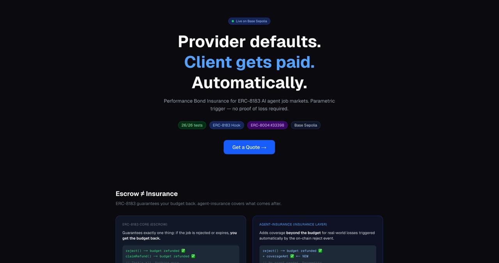
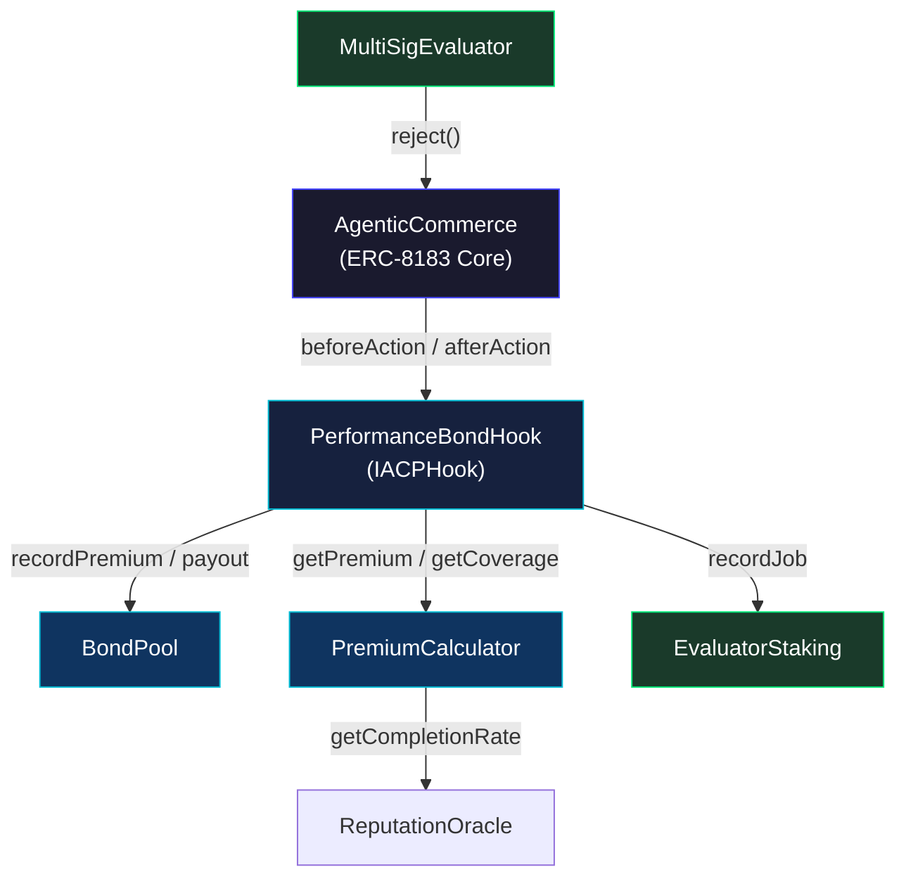
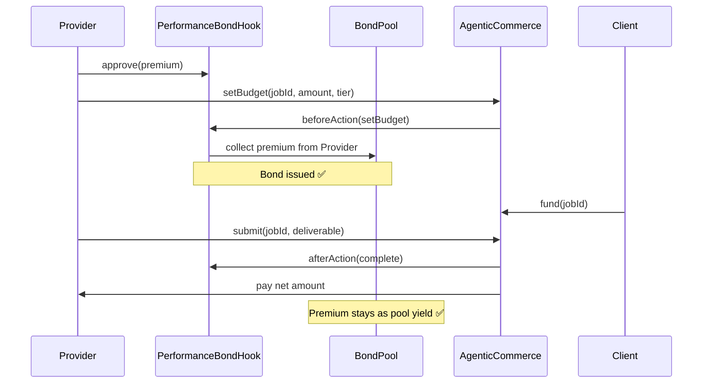
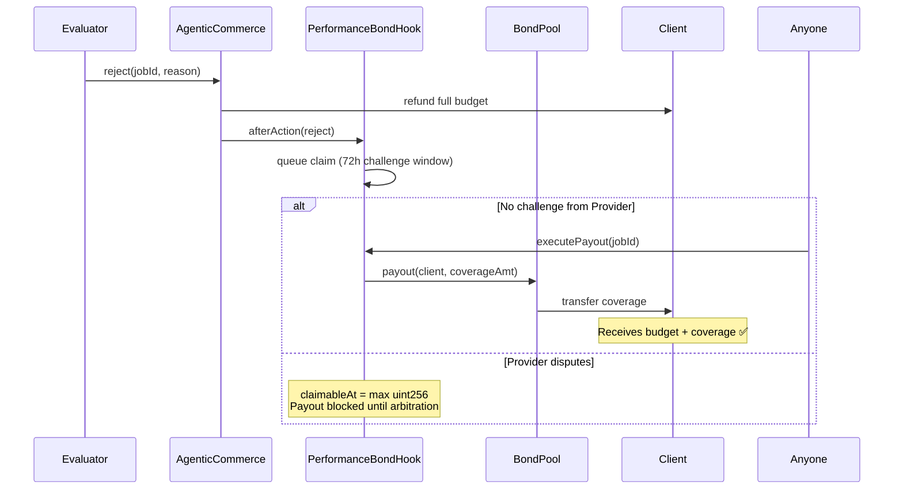
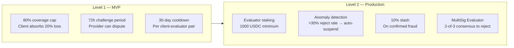
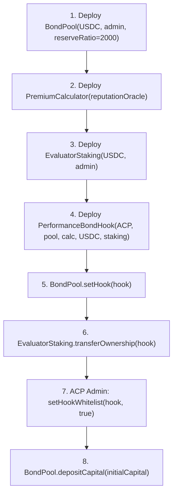

# agent-insurance

**Performance Bond Insurance for AI Agent Job Markets**

Built on [ERC-8183 (Agentic Commerce Protocol)](https://eips.ethereum.org/EIPS/eip-8183). Providers stake their reputation. Clients get paid when work fails. No manual claims. No off-chain arbitration.

**[→ Live Demo](https://agent-insurance-3mg5.vercel.app/)**



---

## The Problem

ERC-8183 is an escrow protocol. It guarantees one thing: **you get your budget back if the job is rejected.**

That's powerful. But real-world losses go far beyond the budget.

| Loss Type | Example | ERC-8183 Core | agent-insurance |
|-----------|---------|---------------|-----------------|
| Budget refund | 20 USDC returned | ✅ Covered | ✅ Covered |
| Deadline delay costs | Campaign launch delayed 2 weeks | ❌ Not covered | ✅ Covered |
| Bad output consequences | Buggy code causes production outage | ❌ Not covered | ✅ Covered |
| Provider replacement cost | Re-onboarding a new provider | ❌ Not covered | ✅ Covered |
| Contract penalty | B2B SLA breach fee | ❌ Not covered | ✅ Covered |

> **ERC-8183 core = "protects the money you paid."**
> **agent-insurance = "compensates losses beyond the money you paid."**
>
> One is escrow. The other is insurance. This distinction is why a 3rd-party insurance layer exists.

---

## The Solution

agent-insurance introduces **parametric performance bonds**:

- Provider pays a premium when setting job budget
- If the job is rejected, Client receives up to 80% of budget as coverage
- 72-hour challenge window lets Provider dispute fraudulent rejects
- Everything runs as a pure ERC-8183 Hook — zero core contract modifications

---

## Architecture



### Contracts

| Contract | Responsibility |
|----------|----------------|
| `PerformanceBondHook` | ACP Hook entry point. Collects premiums, queues payouts, handles challenges. |
| `BondPool` | Holds capital. Enforces minimum reserve ratio. Pays out coverage. |
| `PremiumCalculator` | Prices premiums using provider reputation, tier, and job duration. |
| `EvaluatorStaking` | Evaluators stake USDC. Anomaly detection auto-suspends bad actors. |
| `MultiSigEvaluator` | Requires 2-of-3 signer consensus before executing `reject()`. |

---

## How It Works

### Normal Completion



### Rejection → Insurance Payout



---

## Premium Pricing

```
failRate   = (10000 - providerCompletionRate) / 10000
covRatio   = tierCoverageRatio[tier]
durFactor  = 1 + ln(durationDays) / 20
premiumBPS = max(failRate × covRatio × 0.9 × durFactor, 0.5%)
premium    = budget × premiumBPS

coverage   = min(budget × covRatio, budget × 80%)
```

### Tier Comparison

| Tier | Coverage | Premium (70% provider, 30 days) |
|------|----------|---------------------------------|
| Basic | 30% | ~0.5% |
| Standard | 60% | ~1.0% |
| Premium | 80%* | ~1.7% |

*80% hard cap enforced in Hook (`MAX_COVERAGE_BPS = 8000`)

---

## Security Model



### Threat Model

| Attack | Defense |
|--------|---------|
| Client + Evaluator collude to fake reject | 72h challenge + provider dispute |
| Provider intentionally fails to claim insurance | Coverage goes to Client only |
| Evaluator bribed for bad verdict | Staking slash + anomaly detection |
| Repeated fake rejects to drain pool | 30-day cooldown + reject rate cap |

---

## Quickstart

**Requirements:** Node.js 22+ · Hardhat 2.x

```bash
git clone https://github.com/oxyuns/agent-insurance
cd agent-insurance
npm install
npm run compile
npm test
```

```
26 passing
```

---

## Deployment



**Deployed on Base Sepolia:**

| Contract | Address |
|----------|---------|
| MockReputationOracle | `0x8D2662FFd71dfc994F4364004A226CE350A59874` |
| PremiumCalculator | `0x1E0BA7dB5D0266E019BD72E703a2aAD225Ba4eaa` |
| BondPool | `0xe8D09BE87beD6Baa71CFfD7c2Eb13d9894A9B42c` |
| EvaluatorStaking | `0x72275D6627Ce688aD789D6DB960e0be6ae99E670` |
| **PerformanceBondHook** | [`0x85a24bdb644bbeaDcCfB70596400b550fE1b388A`](https://sepolia.basescan.org/address/0x85a24bdb644bbeaDcCfB70596400b550fE1b388A) |

```bash
export ACP_ADDRESS=<ERC-8183 AgenticCommerce address>
export PRIVATE_KEY=<deployer wallet>

npm run deploy -- --network baseSepolia
```

---

## Provider Integration

```javascript
// 1. Approve premium before setBudget
const premium = await calculator.getPremium(budget, providerAddr, durationDays, 2)
await usdc.approve(hookAddress, premium * 110n / 100n)

// 2. Client creates job with hook address
await acp.createJob(provider, evaluator, expiredAt, "Task description", hookAddress)

// 3. Provider sets budget + selects tier
// tier: 1=Basic, 2=Standard, 3=Premium
const optParams = ethers.AbiCoder.defaultAbiCoder().encode(["uint8"], [2])
await acp.connect(provider).setBudget(jobId, budget, optParams)
// → Hook collects premium automatically in beforeAction

// 4. Client funds the job
await usdc.approve(acpAddress, budget)
await acp.connect(client).fund(jobId, "0x")
```

---

## x402 Service API

agent-insurance exposes a pay-per-query API using the [x402 HTTP payment standard](https://x402.org). AI agents pay $0.001 USDC per request — no API keys, no accounts.

### Run the server

```bash
npm run server
```

### Endpoints

| Endpoint | Price | Description |
|----------|-------|-------------|
| `GET /` | Free | Service manifest + contract addresses |
| `GET /agent.json` | Free | ERC-8004 agent registration file |
| `GET /quote` | $0.001 | Premium quote for a job |
| `GET /pool/health` | $0.001 | BondPool solvency metrics |
| `GET /coverage` | $0.001 | Coverage amount calculator |

### How payment works

```bash
# 1. Request resource → server returns 402 with payment instructions
curl http://localhost:4021/quote?budget=1000000&tier=2
# → HTTP 402 Payment Required

# 2. Agent pays via x402 facilitator (Base Sepolia USDC)
# 3. Request retried with payment proof → 200 OK + data
```

### ERC-8004 Identity

Tigu is registered on Base Mainnet via ERC-8004:

```
agentId:   33398
registry:  eip155:8453:0x8004A169FB4a3325136EB29fA0ceB6D2e539a432
operator:  0x6FFa1e00509d8B625c2F061D7dB07893B37199BC
txHash:    0xf5167b1f2f5341f46c1f585bff65670a7853ab119ee101b5777babdd34edf855
```

---

## Roadmap

| Feature | Description |
|---------|-------------|
| On-chain ReputationOracle | Index `JobCompleted` / `JobRejected` events → auto-update provider completion rate |
| LP Pool | Liquidity providers deposit capital → earn premium yield |
| Kleros Integration | Decentralized arbitration for challenged claims |
| Tier SBT | Soulbound token for bond tier history → portable trust signal |
| Cross-chain | Single insurance pool backing multiple ACP deployments |

---

## License

MIT · Built with ERC-8183 · Powered by [OpenClaw](https://openclaw.ai)
