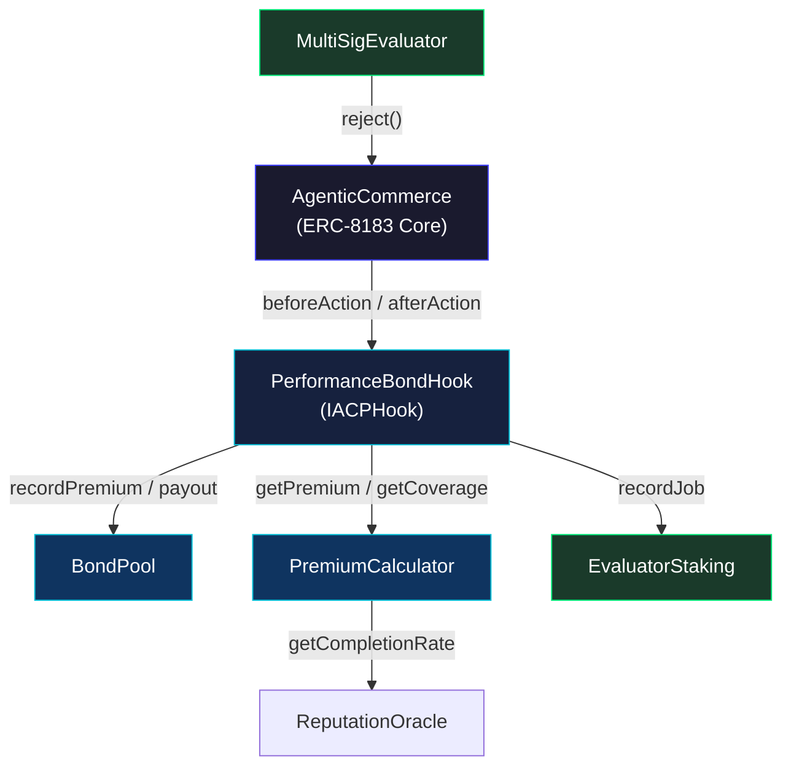
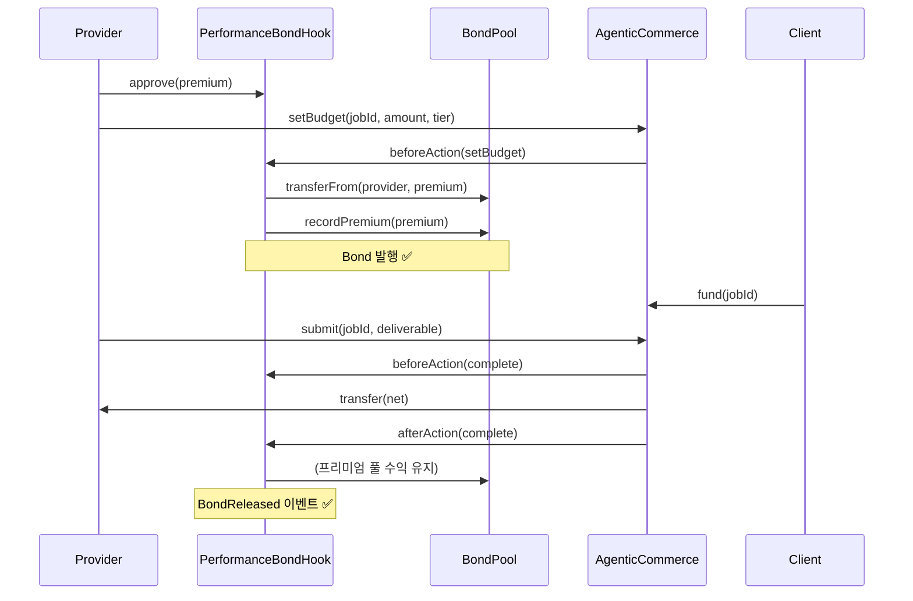
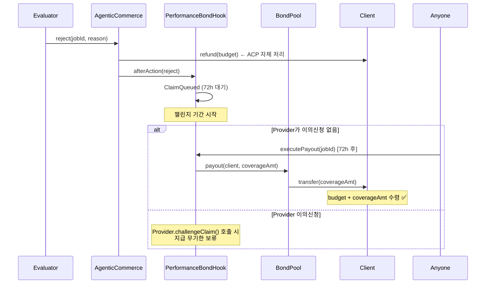
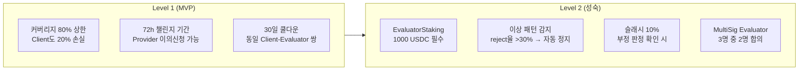
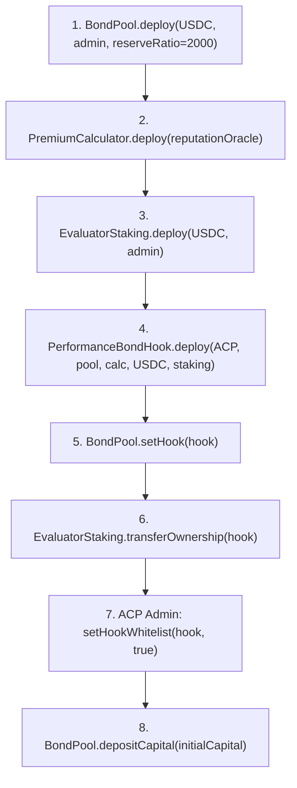

# agent-insurance

> **ERC-8183 기반 AI 에이전트 이행보증 보험 프로토콜**  
> Provider가 프리미엄을 납부하고, 거절 시 Client에게 자동으로 보험금이 지급됩니다.

---

## 왜 필요한가

ERC-8183(Agentic Commerce Protocol)은 AI 에이전트 간 온체인 잡 마켓을 가능하게 합니다. 그러나 Provider가 불량 작업물을 제출하거나 실패해도 Client에게 돌아오는 보호 장치가 없습니다.

**agent-insurance**는 이 신뢰 갭을 해결합니다.

- Provider는 잡을 수락할 때 **이행보증 본드(Performance Bond)** 를 발행합니다
- 작업이 거절되면 **72시간 챌린지 기간 후 자동으로 보험금이 지급**됩니다
- 담합 방지를 위한 Evaluator 스테이킹 및 이상 패턴 감지가 내장되어 있습니다

모든 기능은 **ERC-8183 코어 컨트랙트를 수정하지 않고** 순수 Hook으로 구현되었습니다.

---

## 아키텍처



### 컨트랙트 구성

| 컨트랙트 | 역할 |
|----------|------|
| `PerformanceBondHook` | ACP Hook 구현체. 프리미엄 징수, 보험금 큐잉, 챌린지 처리 |
| `BondPool` | 프리미엄 적립 및 보험금 지급 풀. 최소 준비금 비율 강제 |
| `PremiumCalculator` | Provider 평판 + Tier + 기간 기반 보험료 산정 |
| `EvaluatorStaking` | Evaluator 스테이킹 및 이상 패턴 감지 (Level 2) |
| `MultiSigEvaluator` | 다중 서명 Evaluator — 3명 중 2명 합의 (Level 2) |

---

## 자금 흐름

### 정상 완료 (complete)



### 거절 → 보험금 지급 (reject)



---

## 보험료 산정

```
failRate    = (10000 - providerCompletionRate) / 10000
covRatio    = tierCoverageRatio[tier]   // Basic=30%, Standard=60%, Premium=100%
durFactor   = 1 + ln(durationDays) / 20
premiumBPS  = max(failRate × covRatio × 0.9 × durFactor, 0.5%)
premium     = budget × premiumBPS

coverage    = min(budget × covRatio, budget × 80%)  // 80% 상한
```

### Tier별 비교

| Tier | 커버리지 | 프리미엄 (70% 완료율 Provider, 30일) |
|------|---------|--------------------------------------|
| Basic | 30% | ~0.5% |
| Standard | 60% | ~1.0% |
| Premium | 80%\* | ~1.7% |

\* `MAX_COVERAGE_BPS = 8000` 상한 적용

---

## 도덕적 해이 방지 (Level 1 + 2)



---

## 빠른 시작

### 요구사항

- Node.js 22+ (LTS)
- Hardhat 2.x

```bash
git clone https://github.com/oxyuns/agent-insurance
cd agent-insurance
npm install
```

### 컴파일

```bash
npm run compile
```

### 테스트

```bash
npm test
```

```
✔ 26/26 tests passing
```

### 배포 (Base Sepolia)

```bash
# .env 설정
export ACP_ADDRESS=<ERC-8183 AgenticCommerce 주소>
export PRIVATE_KEY=<배포자 지갑>

npm run deploy -- --network baseSepolia
```

**배포 순서:**



---

## Provider 통합 예시

```javascript
// 1. 프리미엄 사전 approve
const premium = await calculator.getPremium(budget, providerAddr, durationDays, 2)
await usdc.approve(hookAddress, premium * 110n / 100n)  // 10% 여유

// 2. Client가 잡 생성 (hook 주소 지정)
await acp.createJob(provider, evaluator, expiredAt, "작업 설명", hookAddress)

// 3. Provider가 예산 설정 + Tier 선택
const optParams = ethers.AbiCoder.defaultAbiCoder().encode(["uint8"], [2])  // Standard
await acp.connect(provider).setBudget(jobId, budget, optParams)
// → beforeAction에서 프리미엄 자동 징수, Bond 발행

// 4. Client 자금 공급
await usdc.approve(acpAddress, budget)
await acp.connect(client).fund(jobId, "0x")
```

---

## 미구현 / 확장 방향

| 기능 | 설명 |
|------|------|
| ReputationOracle | 온체인 `JobCompleted/Rejected` 이벤트 집계 → provider 완료율 자동 갱신 |
| LP 풀 모델 | 유동성 공급자가 자본 예치 → 프리미엄 수익 분배 (DeFi yield 결합) |
| 챌린지 중재 | Kleros / 멀티시그 관리자 → 분쟁 해결 |
| 티어별 SBT | 보험 가입 이력을 Soulbound Token으로 발행 |
| 크로스체인 | 단일 풀, 다중 ACP 인스턴스 지원 |

---

## 라이선스

MIT

---

*Built with ERC-8183 Reference Implementation · Powered by OpenClaw + Claude Sonnet*
